# Implementation Plan: Community Enhancements Phase 1-2

This document outlines the implementation tasks for Community Enhancements Phase 1 (Foundation Fixes) and Phase 2 (Discovery & Engagement). Tasks are ordered by dependency and grouped by feature.

---

## Section 0: Bug Fixes (Quick Wins)

### Task 0.1: Fix Profile Page Statistics Display
**Complexity:** S
**Files:**
- `app/community/profile/[userId]/page.tsx`
- `app/api/community/profile/route.ts`

**Dependencies:** None

**Description:** Fix the profile page to correctly display and calculate statistics (posts count, connections count). Ensure the counts are fetched from the API and displayed accurately.

**Acceptance Criteria:**
- [ ] Profile displays accurate post count for the user
- [ ] Profile displays accurate connection count
- [ ] Counts update when new posts are created or connections are made
- [ ] Zero values display gracefully ("No posts yet" instead of "0 Posts")

---

### Task 0.2: Fix Sidebar Responsive Behavior on Mobile
**Complexity:** S
**Files:**
- `app/community/page.tsx`

**Dependencies:** None

**Description:** Ensure the community sidebar behaves correctly on mobile viewports. It should default to collapsed on mobile and have proper touch targets.

**Acceptance Criteria:**
- [ ] Sidebar defaults to collapsed on viewports < 768px
- [ ] Sidebar toggle button has minimum 44x44px touch target
- [ ] Content area adjusts properly when sidebar state changes
- [ ] No horizontal overflow issues on mobile

---

### Task 0.3: Fix Comment Reply Visual Hierarchy
**Complexity:** S
**Files:**
- `app/community/page.tsx` (comment rendering section)

**Dependencies:** None

**Description:** Improve the visual hierarchy of nested comments. Currently replies may not be clearly indented or visually connected to parent comments.

**Acceptance Criteria:**
- [ ] Reply comments are visually indented from parent comments
- [ ] Clear visual distinction between top-level and nested comments
- [ ] Consistent styling for all nesting levels
- [ ] Reply indicator shows which comment is being replied to

---

## Section 1: Phase 1 - Foundation Fixes

### 1.1 Sidebar Collapse State Persistence

#### Task 1.1.1: Create localStorage Manager Utility
**Complexity:** S
**Files:**
- `lib/communityStorage.ts` (new file)

**Dependencies:** None

**Description:** Create a centralized localStorage management utility for community-related preferences. This utility will handle all localStorage operations with proper error handling and type safety.

**Acceptance Criteria:**
- [ ] Create `lib/communityStorage.ts` with typed getter/setter functions
- [ ] Implement `getSidebarCollapsed()` and `setSidebarCollapsed()` functions
- [ ] Add error handling for localStorage unavailability (e.g., private browsing)
- [ ] Use `community_` prefix for all keys to avoid collisions
- [ ] Include functions for guidelines acknowledgment and feed filters
- _Requirements: 1.1.1, 1.1.4_

---

#### Task 1.1.2: Implement Sidebar Collapse Persistence in Community Page
**Complexity:** S
**Files:**
- `app/community/page.tsx`

**Dependencies:** Task 1.1.1

**Description:** Integrate the localStorage manager into the community page to persist and restore sidebar collapse state across sessions.

**Acceptance Criteria:**
- [ ] Sidebar initializes from localStorage value on page load
- [ ] Clicking collapse button (<<) updates localStorage immediately
- [ ] Default to expanded state when no saved preference exists
- [ ] State persists across page refreshes and browser sessions
- [ ] No flash of incorrect state during hydration (use useEffect properly)
- _Requirements: 1.1.1, 1.1.2, 1.1.3, 1.1.4_

---

### 1.2 Combined Filter Functionality

#### Task 1.2.1: Create CombinedFilterBar Component
**Complexity:** M
**Files:**
- `components/community/CombinedFilterBar.tsx` (new file)

**Dependencies:** None

**Description:** Create a reusable filter bar component that allows users to select both sort order (Recent, Top, Following, Trending) and post type filter (Question, Win, Insight, Reflection) simultaneously.

**Acceptance Criteria:**
- [ ] Component renders sort options: Recent, Top, Following, Trending
- [ ] Component renders post type filters: Question, Win, Insight, Reflection, All
- [ ] Both filters can be active simultaneously
- [ ] Active filters are visually highlighted
- [ ] Clear individual filter button for each active filter
- [ ] Accessible: keyboard navigation and screen reader support
- [ ] Mobile responsive: collapsible or scrollable on small screens
- _Requirements: 1.2.1, 1.2.2, 1.2.3_

---

#### Task 1.2.2: Create FilterChips Component for Active Filter Display
**Complexity:** S
**Files:**
- `components/community/FilterChips.tsx` (new file)

**Dependencies:** Task 1.2.1

**Description:** Create a component to display active filters as dismissible chips below the filter bar.

**Acceptance Criteria:**
- [ ] Display chips for each active filter (sort and/or post type)
- [ ] Each chip has an X button to remove that filter
- [ ] "Clear all" button when multiple filters are active
- [ ] Smooth animation when chips are added/removed
- [ ] Accessible: proper ARIA labels for dismiss buttons
- _Requirements: 1.2.2, 1.2.3_

---

#### Task 1.2.3: Implement URL Query Parameter Sync for Filters
**Complexity:** M
**Files:**
- `app/community/page.tsx`
- `components/community/CombinedFilterBar.tsx`

**Dependencies:** Task 1.2.1, Task 1.2.2

**Description:** Sync filter state with URL query parameters so filtered views can be shared and bookmarked.

**Acceptance Criteria:**
- [ ] URL updates when filters change (e.g., `/community?sort=top&type=question`)
- [ ] Filters restore from URL on page load
- [ ] Browser back/forward navigation works with filter history
- [ ] Use `replaceState` to avoid polluting history with every filter change
- [ ] Handle invalid URL parameters gracefully (reset to defaults)
- _Requirements: 1.2.4, 1.2.5_

---

#### Task 1.2.4: Update Posts API to Support Combined Filters
**Complexity:** M
**Files:**
- `app/api/community/posts/route.ts`

**Dependencies:** None

**Description:** Modify the posts API to handle multiple simultaneous filter parameters and add support for the new "trending" sort option.

**Acceptance Criteria:**
- [ ] API accepts both `sort` and `post_type` query parameters
- [ ] Both filters apply together (AND logic)
- [ ] Add "trending" sort option using engagement score with time decay
- [ ] Response within 200ms for filter changes (NFR-1)
- [ ] Proper pagination when both filters are active
- _Requirements: 1.2.1, 2.3.1, NFR-1_

---

### 1.3 Comment Threading UI Clarity

#### Task 1.3.1: Create CommentConnector Component
**Complexity:** S
**Files:**
- `components/community/CommentConnector.tsx` (new file)

**Dependencies:** None

**Description:** Create a visual connector line component that links parent comments to their child replies, improving the visual hierarchy of threaded discussions.

**Acceptance Criteria:**
- [ ] Vertical line connecting parent to child comments
- [ ] Line color uses muted theme color (slate-600)
- [ ] Line does not rely solely on color (includes structural indication)
- [ ] Works with up to 3 levels of nesting
- _Requirements: 1.3.6, NFR-2.4_

---

#### Task 1.3.2: Create CommentThread Component
**Complexity:** M
**Files:**
- `components/community/CommentThread.tsx` (new file)

**Dependencies:** Task 1.3.1

**Description:** Create a dedicated comment thread component that handles nested replies with proper visual indentation and the "Replying to @username" pattern for deep nesting.

**Acceptance Criteria:**
- [ ] Display nested replies with progressive left margin/indentation
- [ ] Support up to 3 levels of visual nesting
- [ ] At level 4+, flatten display with "Replying to @username" indicator
- [ ] Reply input appears directly below target comment when replying
- [ ] Include CommentConnector for visual hierarchy
- _Requirements: 1.3.1, 1.3.2, 1.3.3, 1.3.4, 1.3.6_

---

#### Task 1.3.3: Implement "View More Replies" Functionality
**Complexity:** S
**Files:**
- `components/community/CommentThread.tsx`

**Dependencies:** Task 1.3.2

**Description:** Add collapsible reply threads when there are more than 5 replies to a comment.

**Acceptance Criteria:**
- [ ] Show first 3 replies by default when thread has >5 replies
- [ ] Display "View X more replies" link to expand
- [ ] Smooth expand/collapse animation
- [ ] Maintain scroll position when expanding
- _Requirements: 1.3.5_

---

#### Task 1.3.4: Integrate CommentThread into Community Page
**Complexity:** S
**Files:**
- `app/community/page.tsx`

**Dependencies:** Task 1.3.2, Task 1.3.3

**Description:** Replace the existing comment rendering logic with the new CommentThread component.

**Acceptance Criteria:**
- [ ] All existing comment functionality preserved (like, reply, delete)
- [ ] New visual hierarchy applied to all post comments
- [ ] Performance maintained with large comment threads
- [ ] Mobile responsive design
- _Requirements: 1.3.1-1.3.6, NFR-3_

---

### 1.4 Community Guidelines Prominence

#### Task 1.4.1: Create GuidelinesModal Component
**Complexity:** S
**Files:**
- `components/community/GuidelinesModal.tsx` (new file)

**Dependencies:** Task 1.1.1 (for localStorage)

**Description:** Create a modal component that displays community guidelines summary with acknowledgment requirement.

**Acceptance Criteria:**
- [ ] Modal displays key community guidelines summary
- [ ] Link to full guidelines page (`/community/guidelines`)
- [ ] "I understand" acknowledgment button
- [ ] Cannot be dismissed without acknowledgment (for first-post)
- [ ] Accessible: focus trap, escape key, proper ARIA
- _Requirements: 1.4.1, 1.4.4_

---

#### Task 1.4.2: Implement First-Post Guidelines Check
**Complexity:** S
**Files:**
- `app/community/page.tsx`
- `lib/communityStorage.ts`

**Dependencies:** Task 1.4.1, Task 1.1.1

**Description:** Show the guidelines modal when a user clicks "Post" for the first time, requiring acknowledgment before proceeding.

**Acceptance Criteria:**
- [ ] Modal triggers on first post attempt (before submission)
- [ ] Check localStorage for `guidelines_acknowledged_{userId}`
- [ ] After acknowledgment, proceed with post submission
- [ ] Modal does not show on subsequent posts
- [ ] Works for both new posts and first-time returning users
- _Requirements: 1.4.1, 1.4.3, 1.4.4_

---

#### Task 1.4.3: Add Guidelines Link to Community Sidebar
**Complexity:** S
**Files:**
- `app/community/page.tsx`

**Dependencies:** None

**Description:** Add a prominent link to community guidelines in the sidebar's "Community Info" section.

**Acceptance Criteria:**
- [ ] Guidelines link visible in sidebar under "Community Info"
- [ ] Link opens `/community/guidelines` page
- [ ] Appropriate icon (e.g., document or shield icon)
- [ ] Visible in both collapsed and expanded sidebar states
- _Requirements: 1.4.2_

---

### 1.5 Chat Metric Clarification

#### Task 1.5.1: Create ChatMetricTooltip Component
**Complexity:** S
**Files:**
- `components/community/ChatMetricTooltip.tsx` (new file)

**Dependencies:** None

**Description:** Create a tooltip component for the chat count metric that explains what it represents and makes it clickable.

**Acceptance Criteria:**
- [ ] Tooltip appears on hover with text "Active direct message conversations"
- [ ] Metric is clickable and navigates to messages page
- [ ] Shows "No chats yet" when count is 0
- [ ] Accessible: works with keyboard focus
- _Requirements: 1.5.1, 1.5.2, 1.5.4_

---

#### Task 1.5.2: Update Profile to Use ChatMetricTooltip
**Complexity:** S
**Files:**
- `app/community/profile/[userId]/page.tsx`
- `app/community/page.tsx` (profile section)

**Dependencies:** Task 1.5.1

**Description:** Replace the existing chat count display with the new ChatMetricTooltip component.

**Acceptance Criteria:**
- [ ] Chat metric displays with tooltip on hover
- [ ] Click navigates to `/community/messages` or conversation list
- [ ] Only count conversations with at least one message
- [ ] Display "No chats yet" for zero conversations
- _Requirements: 1.5.1, 1.5.2, 1.5.3, 1.5.4_

---

## Section 2: Phase 2 - Discovery & Engagement

### 2.1 Database Migrations

#### Task 2.1.1: Create Phase 1 Database Migration
**Complexity:** M
**Files:**
- `supabase/migrations/[timestamp]_community_enhancements_phase1.sql` (new file)

**Dependencies:** None

**Description:** Create the database migration for Phase 1 schema changes including user_preferences table.

**Acceptance Criteria:**
- [ ] Create `user_preferences` table with sidebar_collapsed, guidelines_acknowledged fields
- [ ] Add RLS policies for user_preferences (owner only)
- [ ] Add indexes for efficient queries
- [ ] Migration is reversible (down migration)
- [ ] Test migration on staging environment
- _Requirements: 1.1, 1.4_

---

#### Task 2.1.2: Create Hashtags Schema Migration
**Complexity:** M
**Files:**
- `supabase/migrations/[timestamp]_community_hashtags.sql` (new file)

**Dependencies:** Task 2.1.1

**Description:** Create the hashtags and post_hashtags tables for the tagging system.

**Acceptance Criteria:**
- [ ] Create `hashtags` table with name, normalized_name, usage_count
- [ ] Create `post_hashtags` junction table
- [ ] Add RLS policies (public read, authenticated write)
- [ ] Add indexes for hashtag suggestions and trending queries
- [ ] Create `process_post_hashtags` database function
- [ ] Create `get_trending_hashtags` database function
- _Requirements: 2.2.1, 2.2.3, 2.3.3_

---

#### Task 2.1.3: Create Link Previews Schema Migration
**Complexity:** S
**Files:**
- `supabase/migrations/[timestamp]_community_link_previews.sql` (new file)

**Dependencies:** Task 2.1.1

**Description:** Create tables for caching link preview metadata.

**Acceptance Criteria:**
- [ ] Create `link_previews` table with OG metadata fields
- [ ] Create `post_link_previews` junction table
- [ ] Add url_hash index for fast lookups
- [ ] Add cache expiration index
- [ ] Add RLS policies (public read)
- _Requirements: 2.5.3_

---

#### Task 2.1.4: Create Mentorship Schema Migration
**Complexity:** M
**Files:**
- `supabase/migrations/[timestamp]_community_mentorship.sql` (new file)

**Dependencies:** Task 2.1.1

**Description:** Create tables for mentorship requests and modify existing tables for mentor features.

**Acceptance Criteria:**
- [ ] Create `mentorship_requests` table with status tracking
- [ ] Add `mentor_availability` and `mentor_statement` columns to `community_profiles`
- [ ] Add `is_mentorship` flag to `connections` table
- [ ] Add `profile_completion_score` to `community_profiles`
- [ ] Add RLS policies for mentorship requests (participants only)
- [ ] Add indexes for mentor filtering queries
- _Requirements: 2.1.4, 2.1.5, 2.1.6, 2.4.3_

---

#### Task 2.1.5: Create Trending Score Migration
**Complexity:** S
**Files:**
- `supabase/migrations/[timestamp]_community_trending.sql` (new file)

**Dependencies:** Task 2.1.1

**Description:** Add trending score column and function to community_posts table.

**Acceptance Criteria:**
- [ ] Add `trending_score` column to `community_posts`
- [ ] Add `last_engagement_at` column
- [ ] Create `calculate_trending_score` database function
- [ ] Add index for trending queries
- [ ] Create trigger to update trending score on engagement
- _Requirements: 2.3.1, 2.3.2_

---

### 2.2 Hashtag System

#### Task 2.2.1: Create Hashtags API Route
**Complexity:** M
**Files:**
- `app/api/community/hashtags/route.ts` (new file)

**Dependencies:** Task 2.1.2

**Description:** Create API endpoint for hashtag suggestions and retrieval.

**Acceptance Criteria:**
- [ ] GET endpoint with query parameter for prefix search
- [ ] Support `trending=true` parameter for trending hashtags
- [ ] Return hashtags with usage counts
- [ ] Results ordered by usage frequency
- [ ] Response within 100ms (NFR-1)
- [ ] Limit to 10 results by default
- _Requirements: 2.2.2, 2.2.5_

---

#### Task 2.2.2: Create HashtagInput Component
**Complexity:** M
**Files:**
- `components/community/HashtagInput.tsx` (new file)

**Dependencies:** Task 2.2.1

**Description:** Create an input component that detects hashtags and shows autocomplete suggestions.

**Acceptance Criteria:**
- [ ] Detect when user types `#` followed by characters
- [ ] Show dropdown with matching hashtag suggestions
- [ ] Suggestions appear within 100ms of typing (NFR-1)
- [ ] Keyboard navigation for suggestions (up/down/enter)
- [ ] Limit to 5 hashtags per post
- [ ] Display selected hashtags as chips
- _Requirements: 2.2.1, 2.2.2, NFR-1_

---

#### Task 2.2.3: Create HashtagChip Component
**Complexity:** S
**Files:**
- `components/community/HashtagChip.tsx` (new file)

**Dependencies:** None

**Description:** Create a styled chip component for displaying hashtags that are clickable to filter.

**Acceptance Criteria:**
- [ ] Clickable chip design with `#` prefix
- [ ] Hover state indicates clickability
- [ ] Click triggers filter by hashtag
- [ ] Accessible with proper role and keyboard support
- _Requirements: 2.2.4_

---

#### Task 2.2.4: Integrate Hashtag Extraction into Post Creation
**Complexity:** M
**Files:**
- `app/api/community/posts/route.ts`

**Dependencies:** Task 2.1.2

**Description:** Modify the POST /posts endpoint to automatically extract and store hashtags from post content.

**Acceptance Criteria:**
- [ ] Extract hashtags using regex pattern `#[a-zA-Z][a-zA-Z0-9_]{1,29}`
- [ ] Limit to 5 hashtags per post
- [ ] Call `process_post_hashtags` database function
- [ ] Handle hashtags in URLs (ignore them)
- [ ] Update hashtag usage counts
- _Requirements: 2.2.1, 2.2.3, NFR-4.1_

---

#### Task 2.2.5: Add Hashtag Filtering to Feed
**Complexity:** S
**Files:**
- `app/community/page.tsx`
- `app/api/community/posts/route.ts`

**Dependencies:** Task 2.2.3, Task 2.2.4

**Description:** Add ability to filter the feed by clicking on a hashtag.

**Acceptance Criteria:**
- [ ] Clicking hashtag adds filter to feed
- [ ] URL updates with `hashtag` parameter
- [ ] Filter combines with existing sort/type filters
- [ ] Clear hashtag filter button in FilterChips
- _Requirements: 2.2.4_

---

### 2.3 Trending Posts View

#### Task 2.3.1: Create Trending API Route
**Complexity:** M
**Files:**
- `app/api/community/trending/route.ts` (new file)

**Dependencies:** Task 2.1.5, Task 2.1.2

**Description:** Create API endpoint for retrieving trending posts and hashtags.

**Acceptance Criteria:**
- [ ] GET endpoint returns trending posts and hashtags
- [ ] Support `period` parameter (day, week, month)
- [ ] Trending score calculated using engagement + recency
- [ ] Return top 20 posts by engagement
- [ ] Return top 5 trending hashtags
- _Requirements: 2.3.1, 2.3.2, 2.3.3_

---

#### Task 2.3.2: Create TrendingTopics Sidebar Component
**Complexity:** S
**Files:**
- `components/community/TrendingTopics.tsx` (new file)

**Dependencies:** Task 2.3.1

**Description:** Create a sidebar component showing trending hashtags for the last 7 days.

**Acceptance Criteria:**
- [ ] Display top 5 hashtags with post counts
- [ ] Each hashtag is clickable to filter feed
- [ ] Show "Trending" header with time period
- [ ] Graceful empty state: "No trending topics yet"
- [ ] Auto-refresh every 5 minutes
- _Requirements: 2.3.3_

---

#### Task 2.3.3: Create TrendingBadge Component
**Complexity:** S
**Files:**
- `components/community/TrendingBadge.tsx` (new file)

**Dependencies:** None

**Description:** Create a small badge indicator for posts that are currently trending.

**Acceptance Criteria:**
- [ ] Small flame or chart icon with "Trending" text
- [ ] Positioned on post card (top right corner)
- [ ] Appears only on posts meeting trending threshold
- [ ] Accessible: includes sr-only label
- _Requirements: 2.3.4_

---

#### Task 2.3.4: Integrate Trending into Feed
**Complexity:** S
**Files:**
- `app/community/page.tsx`

**Dependencies:** Task 2.3.1, Task 2.3.2, Task 2.3.3

**Description:** Add trending view to the feed and integrate TrendingTopics into sidebar.

**Acceptance Criteria:**
- [ ] "Trending" option in sort dropdown
- [ ] TrendingTopics component visible in sidebar
- [ ] TrendingBadge displays on qualifying posts
- [ ] Handle empty trending state with fallback message
- _Requirements: 2.3.1-2.3.5_

---

### 2.4 Mentors Tab & Discovery

#### Task 2.4.1: Create Mentors API Route
**Complexity:** M
**Files:**
- `app/api/community/mentors/route.ts` (new file)

**Dependencies:** Task 2.1.4

**Description:** Create API endpoint for searching and filtering mentors.

**Acceptance Criteria:**
- [ ] GET endpoint with filter parameters (specialty, experience, availability)
- [ ] Return mentor profiles with availability status
- [ ] Include connection status for current user
- [ ] Support pagination (20 per page)
- [ ] Search by name and bio content
- _Requirements: 2.1.1, 2.1.2, 2.1.3_

---

#### Task 2.4.2: Create MentorCard Component
**Complexity:** M
**Files:**
- `components/community/MentorCard.tsx` (new file)

**Dependencies:** None

**Description:** Create a card component for displaying mentor information.

**Acceptance Criteria:**
- [ ] Display name, avatar, years of experience
- [ ] Show primary specialties (up to 3)
- [ ] Availability indicator with color (green/yellow/red) AND text label
- [ ] "What I offer" statement display
- [ ] "Request Mentorship" button
- [ ] Accessible: color indicators have text alternatives
- _Requirements: 2.1.3, NFR-2.3_

---

#### Task 2.4.3: Create MentorFilters Component
**Complexity:** S
**Files:**
- `components/community/MentorFilters.tsx` (new file)

**Dependencies:** None

**Description:** Create filter controls for the mentors tab.

**Acceptance Criteria:**
- [ ] Specialty dropdown/multi-select
- [ ] Experience range selector (0-2, 3-5, 6-10, 10+)
- [ ] Availability filter (Available, Limited, Not Available)
- [ ] Real-time filter application (no submit button)
- [ ] Clear all filters option
- _Requirements: 2.1.1_

---

#### Task 2.4.4: Create Mentorship Request API Route
**Complexity:** M
**Files:**
- `app/api/community/mentorship/route.ts` (new file)

**Dependencies:** Task 2.1.4

**Description:** Create API endpoints for creating, viewing, and responding to mentorship requests.

**Acceptance Criteria:**
- [ ] POST to create new mentorship request
- [ ] GET to retrieve user's requests (sent and received)
- [ ] PUT to accept or decline requests
- [ ] Prevent duplicate pending requests
- [ ] Update connection with mentorship flag on acceptance
- _Requirements: 2.1.4, 2.1.5, 2.1.6_

---

#### Task 2.4.5: Create MentorshipRequestModal Component
**Complexity:** S
**Files:**
- `components/community/MentorshipRequestModal.tsx` (new file)

**Dependencies:** Task 2.4.4

**Description:** Create a modal for requesting mentorship with optional intro message.

**Acceptance Criteria:**
- [ ] Display mentor name and avatar
- [ ] Optional textarea for intro message
- [ ] Submit sends request via API
- [ ] Loading state during submission
- [ ] Success/error feedback
- _Requirements: 2.1.4_

---

#### Task 2.4.6: Create MentorsTab Component
**Complexity:** M
**Files:**
- `components/community/MentorsTab.tsx` (new file)

**Dependencies:** Task 2.4.1, Task 2.4.2, Task 2.4.3, Task 2.4.4

**Description:** Create the main Mentors tab view with filtering and mentor list.

**Acceptance Criteria:**
- [ ] Tab displays in community navigation
- [ ] MentorFilters component integrated
- [ ] Paginated list of MentorCard components
- [ ] Real-time filter updates
- [ ] Empty state when no mentors match filters
- _Requirements: 2.1.1, 2.1.2_

---

#### Task 2.4.7: Create MentorshipBadge Component
**Complexity:** S
**Files:**
- `components/community/MentorshipBadge.tsx` (new file)

**Dependencies:** Task 2.4.4

**Description:** Create a badge to display on connection cards indicating mentorship relationship.

**Acceptance Criteria:**
- [ ] "Mentoring" badge design
- [ ] Displays on profile and connection cards
- [ ] Tooltip explains the relationship
- _Requirements: 2.1.6_

---

### 2.5 Link Preview Cards

#### Task 2.5.1: Create Link Preview API Route
**Complexity:** M
**Files:**
- `app/api/community/link-preview/route.ts` (new file)

**Dependencies:** Task 2.1.3

**Description:** Create API endpoint for fetching and caching Open Graph metadata from URLs.

**Acceptance Criteria:**
- [ ] GET endpoint with `url` query parameter
- [ ] Fetch Open Graph meta tags (title, description, image)
- [ ] 5-second timeout for external fetch
- [ ] Cache results in database for 30 days
- [ ] Return cached results when available
- [ ] Detect YouTube/Vimeo URLs and extract video info
- [ ] Return null gracefully on fetch failure
- _Requirements: 2.5.1, 2.5.6, 2.5.7, 2.5.8_

---

#### Task 2.5.2: Create LinkPreviewCard Component
**Complexity:** M
**Files:**
- `components/community/LinkPreviewCard.tsx` (new file)

**Dependencies:** None

**Description:** Create a rich preview card component for displaying link metadata.

**Acceptance Criteria:**
- [ ] Display favicon/logo, title, description, preview image
- [ ] Title truncated to 100 characters
- [ ] Description truncated to 200 characters
- [ ] Domain name displayed
- [ ] Entire card clickable, opens link in new tab
- [ ] Loading skeleton state while fetching
- _Requirements: 2.5.2, 2.5.4, 2.5.5_

---

#### Task 2.5.3: Create VideoEmbed Component
**Complexity:** S
**Files:**
- `components/community/VideoEmbed.tsx` (new file)

**Dependencies:** None

**Description:** Create an embedded video player component for YouTube and Vimeo links.

**Acceptance Criteria:**
- [ ] Support YouTube embed URLs
- [ ] Support Vimeo embed URLs
- [ ] Responsive aspect ratio (16:9)
- [ ] Show thumbnail until user clicks to play
- [ ] Accessible: proper iframe title
- _Requirements: 2.5.7_

---

#### Task 2.5.4: Integrate Link Preview into Post Composer
**Complexity:** M
**Files:**
- `app/community/page.tsx` (post composer section)

**Dependencies:** Task 2.5.1, Task 2.5.2, Task 2.5.3

**Description:** Detect URLs in post content and show preview cards in the composer.

**Acceptance Criteria:**
- [ ] Detect URLs as user types (debounced)
- [ ] Fetch and display preview below post content
- [ ] Show loading state during fetch
- [ ] Allow user to remove preview (X button)
- [ ] Preview removed if URL is deleted from content
- [ ] Support multiple URLs (show first one)
- _Requirements: 2.5.1, 2.5.9, NFR-1.3_

---

#### Task 2.5.5: Display Link Previews on Saved Posts
**Complexity:** S
**Files:**
- `app/community/page.tsx` (post card rendering)
- `app/api/community/posts/route.ts`

**Dependencies:** Task 2.5.2, Task 2.5.3, Task 2.1.3

**Description:** Save link preview data with posts and display on feed.

**Acceptance Criteria:**
- [ ] Store link preview association when post is created
- [ ] Include preview data in post API response
- [ ] Render LinkPreviewCard or VideoEmbed on post cards
- _Requirements: 2.5.3, 2.5.4_

---

### 2.6 Enhanced New User Onboarding

#### Task 2.6.1: Create Onboarding API Route
**Complexity:** M
**Files:**
- `app/api/community/onboarding/route.ts` (new file)

**Dependencies:** Task 2.1.4

**Description:** Create API endpoint for onboarding state and suggestions.

**Acceptance Criteria:**
- [ ] GET returns profile completion score and checklist
- [ ] Return suggested people to follow (3-5 matching users)
- [ ] Return popular posts (3-5 highly-engaged posts)
- [ ] PUT to update onboarding state (dismissed)
- [ ] Calculate completion: avatar, bio, specialties, first post, first connection
- _Requirements: 2.4.1, 2.4.2, 2.4.3_

---

#### Task 2.6.2: Create ProfileCompletionCard Component
**Complexity:** S
**Files:**
- `components/community/ProfileCompletionCard.tsx` (new file)

**Dependencies:** Task 2.6.1

**Description:** Create a progress indicator card showing profile completion status.

**Acceptance Criteria:**
- [ ] Visual progress bar (0-100%)
- [ ] Checklist of completion items with checkmarks
- [ ] Each uncompleted item is actionable (links to complete)
- [ ] Celebration message at 100% completion
- _Requirements: 2.4.3, 2.4.4_

---

#### Task 2.6.3: Create SuggestedPeopleList Component
**Complexity:** S
**Files:**
- `components/community/SuggestedPeopleList.tsx` (new file)

**Dependencies:** Task 2.6.1

**Description:** Create a component showing suggested people to follow based on matching criteria.

**Acceptance Criteria:**
- [ ] Display 3-5 suggested users
- [ ] Show avatar, name, shared interests
- [ ] "Follow" button for each suggestion
- [ ] Refresh/skip option for different suggestions
- _Requirements: 2.4.1, 2.4.2_

---

#### Task 2.6.4: Create PopularPostsList Component
**Complexity:** S
**Files:**
- `components/community/PopularPostsList.tsx` (new file)

**Dependencies:** Task 2.6.1

**Description:** Create a component showing popular posts relevant to the new user.

**Acceptance Criteria:**
- [ ] Display 3-5 highly-engaged posts
- [ ] Show post preview with engagement counts
- [ ] Click navigates to full post
- [ ] Posts filtered by user's specialties when available
- _Requirements: 2.4.1_

---

#### Task 2.6.5: Create OnboardingDashboard Component
**Complexity:** M
**Files:**
- `components/community/OnboardingDashboard.tsx` (new file)

**Dependencies:** Task 2.6.2, Task 2.6.3, Task 2.6.4

**Description:** Create the main onboarding dashboard that combines all onboarding components.

**Acceptance Criteria:**
- [ ] Welcome message with user's name
- [ ] ProfileCompletionCard component
- [ ] SuggestedPeopleList component
- [ ] PopularPostsList component
- [ ] Dismiss button to hide dashboard
- [ ] Remember dismiss preference (localStorage + API)
- _Requirements: 2.4.1, 2.4.5_

---

#### Task 2.6.6: Integrate Onboarding Dashboard into Community Page
**Complexity:** S
**Files:**
- `app/community/page.tsx`

**Dependencies:** Task 2.6.5

**Description:** Show the onboarding dashboard to new users who haven't completed or dismissed it.

**Acceptance Criteria:**
- [ ] Dashboard appears for new users (profile completion < 100%)
- [ ] Dashboard hidden for users who dismissed it
- [ ] Positioned prominently at top of feed
- [ ] Does not appear if onboarding already completed
- _Requirements: 2.4.1, 2.4.5_

---

## Section 3: Testing & Quality Assurance

### Task 3.1: Write Unit Tests for localStorage Manager
**Complexity:** S
**Files:**
- `lib/communityStorage.test.ts` (new file)

**Dependencies:** Task 1.1.1

**Description:** Create unit tests for the localStorage manager utility.

**Acceptance Criteria:**
- [ ] Test all getter/setter functions
- [ ] Test error handling for localStorage unavailability
- [ ] Test default values
- [ ] Test user-specific key generation

---

### Task 3.2: Write Unit Tests for Hashtag Extraction
**Complexity:** S
**Files:**
- `app/api/community/posts/route.test.ts`

**Dependencies:** Task 2.2.4

**Description:** Create unit tests for hashtag extraction logic.

**Acceptance Criteria:**
- [ ] Test valid hashtag patterns
- [ ] Test hashtag limit (5 max)
- [ ] Test hashtags in URLs are ignored
- [ ] Test special characters handling
- _Requirements: NFR-4.1_

---

### Task 3.3: Write Integration Tests for Filter Combinations
**Complexity:** M
**Files:**
- `tests/integration/filters.test.ts` (new file)

**Dependencies:** Task 1.2.4

**Description:** Create integration tests for combined filter functionality.

**Acceptance Criteria:**
- [ ] Test sort + post_type combination
- [ ] Test sort + hashtag combination
- [ ] Test all three filters together
- [ ] Test filter clearing behavior

---

### Task 3.4: Write Integration Tests for Mentorship Flow
**Complexity:** M
**Files:**
- `tests/integration/mentorship.test.ts` (new file)

**Dependencies:** Task 2.4.4

**Description:** Create integration tests for the mentorship request flow.

**Acceptance Criteria:**
- [ ] Test request creation
- [ ] Test request acceptance
- [ ] Test request decline
- [ ] Test duplicate request prevention
- [ ] Test connection update on acceptance

---

---

## Tasks Dependency Diagram

```mermaid
flowchart TD
    subgraph "Section 0: Bug Fixes"
        T0_1[Task 0.1: Fix Profile Stats]
        T0_2[Task 0.2: Fix Mobile Sidebar]
        T0_3[Task 0.3: Fix Comment Hierarchy]
    end

    subgraph "Section 1: Phase 1 Foundation"
        subgraph "1.1 Sidebar Persistence"
            T1_1_1[Task 1.1.1: localStorage Manager]
            T1_1_2[Task 1.1.2: Sidebar Persistence]
            T1_1_1 --> T1_1_2
        end

        subgraph "1.2 Combined Filters"
            T1_2_1[Task 1.2.1: CombinedFilterBar]
            T1_2_2[Task 1.2.2: FilterChips]
            T1_2_3[Task 1.2.3: URL Sync]
            T1_2_4[Task 1.2.4: Posts API Update]
            T1_2_1 --> T1_2_2
            T1_2_1 --> T1_2_3
            T1_2_2 --> T1_2_3
        end

        subgraph "1.3 Comment Threading"
            T1_3_1[Task 1.3.1: CommentConnector]
            T1_3_2[Task 1.3.2: CommentThread]
            T1_3_3[Task 1.3.3: View More Replies]
            T1_3_4[Task 1.3.4: Integration]
            T1_3_1 --> T1_3_2
            T1_3_2 --> T1_3_3
            T1_3_2 --> T1_3_4
            T1_3_3 --> T1_3_4
        end

        subgraph "1.4 Guidelines"
            T1_4_1[Task 1.4.1: GuidelinesModal]
            T1_4_2[Task 1.4.2: First-Post Check]
            T1_4_3[Task 1.4.3: Sidebar Link]
            T1_1_1 --> T1_4_1
            T1_4_1 --> T1_4_2
        end

        subgraph "1.5 Chat Metric"
            T1_5_1[Task 1.5.1: ChatMetricTooltip]
            T1_5_2[Task 1.5.2: Profile Integration]
            T1_5_1 --> T1_5_2
        end
    end

    subgraph "Section 2: Phase 2 Discovery"
        subgraph "2.1 Migrations"
            T2_1_1[Task 2.1.1: Phase 1 Migration]
            T2_1_2[Task 2.1.2: Hashtags Schema]
            T2_1_3[Task 2.1.3: Link Previews Schema]
            T2_1_4[Task 2.1.4: Mentorship Schema]
            T2_1_5[Task 2.1.5: Trending Schema]
            T2_1_1 --> T2_1_2
            T2_1_1 --> T2_1_3
            T2_1_1 --> T2_1_4
            T2_1_1 --> T2_1_5
        end

        subgraph "2.2 Hashtags"
            T2_2_1[Task 2.2.1: Hashtags API]
            T2_2_2[Task 2.2.2: HashtagInput]
            T2_2_3[Task 2.2.3: HashtagChip]
            T2_2_4[Task 2.2.4: Post Integration]
            T2_2_5[Task 2.2.5: Feed Filter]
            T2_1_2 --> T2_2_1
            T2_2_1 --> T2_2_2
            T2_2_3 --> T2_2_5
            T2_1_2 --> T2_2_4
            T2_2_4 --> T2_2_5
        end

        subgraph "2.3 Trending"
            T2_3_1[Task 2.3.1: Trending API]
            T2_3_2[Task 2.3.2: TrendingTopics]
            T2_3_3[Task 2.3.3: TrendingBadge]
            T2_3_4[Task 2.3.4: Feed Integration]
            T2_1_5 --> T2_3_1
            T2_1_2 --> T2_3_1
            T2_3_1 --> T2_3_2
            T2_3_1 --> T2_3_4
            T2_3_2 --> T2_3_4
            T2_3_3 --> T2_3_4
        end

        subgraph "2.4 Mentors"
            T2_4_1[Task 2.4.1: Mentors API]
            T2_4_2[Task 2.4.2: MentorCard]
            T2_4_3[Task 2.4.3: MentorFilters]
            T2_4_4[Task 2.4.4: Mentorship API]
            T2_4_5[Task 2.4.5: RequestModal]
            T2_4_6[Task 2.4.6: MentorsTab]
            T2_4_7[Task 2.4.7: MentorshipBadge]
            T2_1_4 --> T2_4_1
            T2_1_4 --> T2_4_4
            T2_4_4 --> T2_4_5
            T2_4_1 --> T2_4_6
            T2_4_2 --> T2_4_6
            T2_4_3 --> T2_4_6
            T2_4_4 --> T2_4_6
            T2_4_4 --> T2_4_7
        end

        subgraph "2.5 Link Previews"
            T2_5_1[Task 2.5.1: Link Preview API]
            T2_5_2[Task 2.5.2: LinkPreviewCard]
            T2_5_3[Task 2.5.3: VideoEmbed]
            T2_5_4[Task 2.5.4: Composer Integration]
            T2_5_5[Task 2.5.5: Post Display]
            T2_1_3 --> T2_5_1
            T2_5_1 --> T2_5_4
            T2_5_2 --> T2_5_4
            T2_5_3 --> T2_5_4
            T2_5_2 --> T2_5_5
            T2_5_3 --> T2_5_5
            T2_1_3 --> T2_5_5
        end

        subgraph "2.6 Onboarding"
            T2_6_1[Task 2.6.1: Onboarding API]
            T2_6_2[Task 2.6.2: ProfileCompletionCard]
            T2_6_3[Task 2.6.3: SuggestedPeople]
            T2_6_4[Task 2.6.4: PopularPosts]
            T2_6_5[Task 2.6.5: OnboardingDashboard]
            T2_6_6[Task 2.6.6: Page Integration]
            T2_1_4 --> T2_6_1
            T2_6_1 --> T2_6_2
            T2_6_1 --> T2_6_3
            T2_6_1 --> T2_6_4
            T2_6_2 --> T2_6_5
            T2_6_3 --> T2_6_5
            T2_6_4 --> T2_6_5
            T2_6_5 --> T2_6_6
        end
    end

    subgraph "Section 3: Testing"
        T3_1[Task 3.1: localStorage Tests]
        T3_2[Task 3.2: Hashtag Tests]
        T3_3[Task 3.3: Filter Tests]
        T3_4[Task 3.4: Mentorship Tests]
        T1_1_1 --> T3_1
        T2_2_4 --> T3_2
        T1_2_4 --> T3_3
        T2_4_4 --> T3_4
    end

    %% Cross-section dependencies
    T1_1_1 --> T1_4_2

    %% Styling
    style T0_1 fill:#ffcdd2
    style T0_2 fill:#ffcdd2
    style T0_3 fill:#ffcdd2
    style T2_1_1 fill:#e1f5fe
    style T2_1_2 fill:#e1f5fe
    style T2_1_3 fill:#e1f5fe
    style T2_1_4 fill:#e1f5fe
    style T2_1_5 fill:#e1f5fe
```

**Legend:**
- Red nodes: Bug fixes (quick wins)
- Light blue nodes: Database migrations (foundation)
- Default nodes: Feature implementation tasks

---

## Implementation Order Summary

**Recommended order for maximum parallelization:**

1. **Parallel Track A (Bug Fixes):** Tasks 0.1, 0.2, 0.3
2. **Parallel Track B (Phase 1 Foundation):**
   - Start: 1.1.1, 1.2.1, 1.2.4, 1.3.1, 1.4.3, 1.5.1
   - Then: 1.1.2, 1.2.2, 1.3.2, 1.4.1, 1.5.2
   - Then: 1.2.3, 1.3.3, 1.3.4, 1.4.2
3. **Parallel Track C (Migrations):** 2.1.1, then 2.1.2-2.1.5 in parallel
4. **Parallel Track D (Phase 2 Features):** After respective migrations complete
5. **Final Track (Testing):** After feature implementations

---

## File Summary

### New Files to Create:
- `lib/communityStorage.ts`
- `lib/communityStorage.test.ts`
- `components/community/CombinedFilterBar.tsx`
- `components/community/FilterChips.tsx`
- `components/community/CommentConnector.tsx`
- `components/community/CommentThread.tsx`
- `components/community/GuidelinesModal.tsx`
- `components/community/ChatMetricTooltip.tsx`
- `components/community/HashtagInput.tsx`
- `components/community/HashtagChip.tsx`
- `components/community/TrendingTopics.tsx`
- `components/community/TrendingBadge.tsx`
- `components/community/MentorsTab.tsx`
- `components/community/MentorCard.tsx`
- `components/community/MentorFilters.tsx`
- `components/community/MentorshipRequestModal.tsx`
- `components/community/MentorshipBadge.tsx`
- `components/community/LinkPreviewCard.tsx`
- `components/community/VideoEmbed.tsx`
- `components/community/OnboardingDashboard.tsx`
- `components/community/ProfileCompletionCard.tsx`
- `components/community/SuggestedPeopleList.tsx`
- `components/community/PopularPostsList.tsx`
- `app/api/community/preferences/route.ts`
- `app/api/community/hashtags/route.ts`
- `app/api/community/link-preview/route.ts`
- `app/api/community/mentors/route.ts`
- `app/api/community/mentorship/route.ts`
- `app/api/community/trending/route.ts`
- `app/api/community/onboarding/route.ts`
- `supabase/migrations/[timestamp]_community_enhancements_phase1.sql`
- `supabase/migrations/[timestamp]_community_hashtags.sql`
- `supabase/migrations/[timestamp]_community_link_previews.sql`
- `supabase/migrations/[timestamp]_community_mentorship.sql`
- `supabase/migrations/[timestamp]_community_trending.sql`
- `tests/integration/filters.test.ts`
- `tests/integration/mentorship.test.ts`

### Files to Modify:
- `app/community/page.tsx`
- `app/community/profile/[userId]/page.tsx`
- `app/api/community/posts/route.ts`
- `app/api/community/profile/route.ts`
